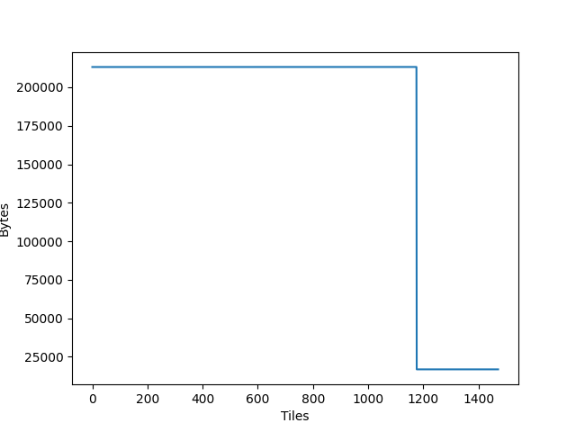

# Tutorial 2: Accessing profiling information

In this tutorial you will learn to use the `libpva` python module, this library
is used to analyse profiles of the programs that run on the IPU. It provides
granular information on the compute and memory exchange steps taken on each
tile of the IPU. You will learn to:

- Use the `libpva` library to access and analyse profiles from the IPU
  execution.

## Setup

For this tutorial we are going to use a PopART MNIST example and capture
profile information that can be read using the PopVision Analysis Library,
which is included in the Poplar SDK package.

The PopART MNIST example is in the `start_here` directory (this is a subset of
the code from the
[simple_applications/popart/mnist](../../../simple_applications/popart/mnist)
directory). Enter the `start_here` directory and follow the instructions in the
README.md to install the required modules and download the data.

Once you have followed the instructions and been able to run the MNIST example
we will re-run the MNIST example with profiling enabled:

```bash
POPLAR_ENGINE_OPTIONS='{"autoReport.all":"true"}' python3 popart_mnist.py
```

When this has completed you will find a file called profile.pop in the training
and inference subdirectories of the current working directory. Note: You can
specify an output directory for the profile files to be written to:

```bash
POPLAR_ENGINE_OPTIONS='{"autoReport.all":"true", "autoReport.directory":"mydirectory"}' python3 popart_mnist.py
```

During the execution of these commands, `inference/profile.pop` and
`training/profile.pop` files were generated. These files report the number of
cycles spent on each operation by each tile of the IPU. This rich profiling
information can be analysed both using the `libpva` python library included in
the Poplar SDK and the PopVision Graph Analyser. Both can be downloaded from
the [Graphcore downloads portal](https://downloads.graphcore.ai/).

## Using the python API

In this tutorial we use the `libpva` library to access profiles of the IPU, the
documentation for it can be found here:
[PopVision Analysis Python API](https://docs.graphcore.ai/projects/libpva/en/latest/api-python.html).

### Loading a profile

Start Python in the directory that contains the profile.pop file you would like
to read. Loading the profile into a Python object is easily done with the
following:

```python
import pva
report = pva.openReport('profile.pop')
```

Now you can access information from the report, as shown in the following examples:

```python
print("Number of compute sets: ", report.compilation.graph.numComputeSets)
print("Number of tiles on target: ", report.compilation.target.numTiles)
print("Version of Poplar used: ", report.poplarVersion.string)
```

Try executing these examples yourself and you should see output similar to the following:

```text
Number of compute sets:  29
Number of tiles on target:  1472
Version of Poplar used:  2.1.0 (df2b00ba5a)
```

You can also iterate over properties such as execution steps, which each
represent the execution of a program in Poplar. In this example, we sum the
total number of cycles on IPU 0 for all execution steps:

```python
sum(step.ipus[0].cycles for step in report.execution.steps)
```

### Using visitors to explore the data

To analyse the compiled program, it is best to use a `ProgramVisitor` class with
the appropriate visitor functions (See [API
Documentation](https://docs.graphcore.ai/projects/libpva/en/latest/api-python.html#pva.ProgramVisitor)
for a list of available methods).

A more general explanation of the ["visitor pattern" is available on
wikipedia](https://en.wikipedia.org/wiki/Visitor_pattern) along with a
[python example](https://en.wikipedia.org/wiki/Visitor_pattern#Python_example).

For example, the following class will print the name of any `OnTileExecute`
programs that use multiple vertices:

```python
class TestVisitor(pva.ProgramVisitor):
    def visitOnTileExecute(self, onTileExecute):
        if len(onTileExecute.computeset.vertices) > 1:
            print(onTileExecute.name)
```

Now we will apply this visitor to every program so that we can see a list of
all `OnTileExecute` programs executed that use multiple vertices:

```python
v = TestVisitor()
for s in report.execution.steps:
    s.program.accept(v)
```

> **NOTE**: You may see a long list of identical names. This is due to multiple
> OnTileExecute steps having the same name, which is to be expected.

You can easily create plots of information using Python's matplotlib library.
The following example plots total memory usage (including gaps) for each tile.

```python
import matplotlib
matplotlib.use('Agg')
import matplotlib.pyplot as plt
plt.plot([tile.memory.total.includingGaps for tile in report.compilation.tiles])
plt.xlabel('Tiles')
plt.ylabel('Bytes')
plt.savefig('MemoryByTilePlot.png')
```

Now open the newly created `MemoryByTilePlot.png` file and you should see a
plot similar to the following.



The examples shown in this tutorial are available in the
[complete/libpva_examples.py](complete/libpva_examples.py) Python script, which
you may run from any directory that contains a profile.pop file. Alternatively,
perhaps you would like the challenge of finishing the incomplete version of
this script in [start_here/libpva_examples.py](start_here/libpva_examples.py).

## Going further with the PopVision Graph Analyser

The profiles (`*.pop` files) generated during this tutorial can also be opened
using the PopVision Graph Analyser desktop tool, it provides a graphical
interface to explore the performance of your programs on the IPU and can enable
you to optimize the usage of tile resources in your IPU application.

[The Poplar profiling tutorial](../../poplar/tut4_profiling/README.rst)
provides a comprehensive example of using the Graph Analyser to profile a
simple IPU application.

You can also find videos introducing many of the features of the Poplar SDK and
the PopVision analysis tools by watching
[Graphcore's introductory videos](https://www.graphcore.ai/resources/how-to-videos).

Copyright (c) 2021 Graphcore Ltd. All rights reserved.
