TensorFlow 1 Pipelining Tutorial
===============================

Table of Contents
=================
* [Introduction](#introduction)
* [Requirements](#requirements)
* [Directory Structure](#directory-structure)
* [Key Principles of Model Pipelining](#key-principles-of-model-pipelining)
    + [Overview](#overview)
        + [Model Parallelism With Sharding](#1-model-parallelism-with-sharding)
        + [Model Parallelism With Pipelining](#2-model-parallelism-with-pipelining)
    + [Pipeline Execution Phases](#pipeline-execution-phases)
* [Tutorial Walkthrough](#tutorial-walkthrough)
    + [Tutorial Step 1: The Existing Single IPU Application](#tutorial-step-1-the-existing-single-ipu-application)
    + [Tutorial Step 2: Running The Model On Multiple IPUs Using Sharding](#tutorial-step-2-running-the-model-on-multiple-ipus-using-sharding)
        + [Code Changes](#tutorial-step-2-code-changes)
    + [Tutorial Step 3: Using Pipelining For Better IPU Utilization](#tutorial-step-3-using-pipelining-for-better-ipu-utilization)
        + [The TensorFlow 1 Pipelining API](#the-tensorflow-1-pipelining-api)
        + [Scheduling](#scheduling)
            + [Sequential Scheduling](#sequential-scheduling)
            + [Interleaved Scheduling](#interleaved-scheduling)
            + [Grouped Scheduling](#grouped-scheduling)
        + [Code Changes](#tutorial-step-3-code-changes)
        + [Extension](#tutorial-step-3-extension)
    + [Tutorial Step 4: Run-time Configurable Stages](#tutorial-step-4-run-time-configurable-stages)
        + [Code Changes](#tutorial-step-4-code-changes)

* [Further Considerations](#further-considerations)
    + [Recomputation](#recomputation)
    + [Variable Offloading](#variable-offloading)
    + [Gradient Accumulation Buffer Data Type](#gradient-accumulation-buffer-data-type)
    + [Data Parallelism](#data-parallelism)
    + [IPUPipelineEstimator](#ipupipelineestimator)


Introduction
------------

If a model is too big to fit on one IPU, you will need to distribute it over multiple IPUs. This is called model parallelism.  
Documentation for model parallelism on IPU with TensorFlow can be found here: [TensorFlow Model Parallelism](<https://docs.graphcore.ai/projects/tf-model-parallelism/en/latest/model.html#model-parallelism>)

This tutorial first provides an overview of the key concepts from this document. It then provides a walkthrough of how pipelining can be applied to an existing TensorFlow application that currently runs on a single IPU.

Requirements
------------

For software installation and setup details, please see the Getting Started guide for your hardware setup, available here: [Getting Started Guides](<https://docs.graphcore.ai/en/latest/getting-started.html>).

You must have installed the Graphcore TensorFlow 1 wheel into your current active Python environment before starting the tutorial.

Directory Structure
-------------------

These are the files including in this tutorial:

| Filename                               | Description                                                                                    |
| -------------------------------------- | ---------------------------------------------------------------------------------------------- |
| `README.md`                            | This README document.                                                                          |
| `step1_single_ipu.py`                  | Step 1 - the existing TensorFlow application that runs **without** pipelining on a single IPU. |
| `answers/step2_sharding.py`            | Step 2 - shows how to run on multiple IPUs, still **without** pipelining.                      |
| `answers/step3_pipelining.py`          | Step 3 - shows how to add pipelining.                                                          |
| `answers/step4_configurable_stages.py` | Step 4 - shows how configurable stages might be implemented.                                   |
| `scripts/profile.sh`                   | Helper script to capture profiling reports.                                                    |
| `images/`                              | Images used in this README.                                                                    |

Key Principles of Model Pipelining
----------------------------------

This section describes the key principles of model pipelining with TensorFlow 1 on IPU. A later section will apply this to the existing TensorFlow application that initially runs on a single IPU.

### Overview

TensorFlow on IPU supports two methods for model parallelism.

#### 1. Model Parallelism With Sharding

With model sharding, the model is split into stages where each stage can fit and be run on a single IPU. The output of each stage is fed to the input of the stage that follows it. Execution of the model is serialised. That is, each stage is executed in turn while the IPUs allocated to other stages remain idle.

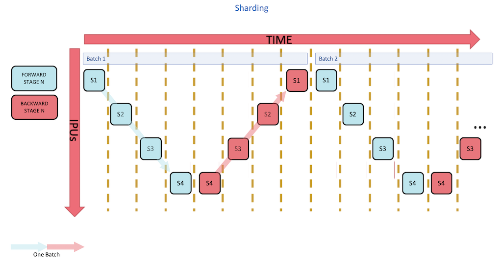

Refer to the technical note on TensorFlow Model Parallelism for full details: [TensorFlow Model Parallelism - Sharding](<https://docs.graphcore.ai/projects/tf-model-parallelism/en/latest/sharding.html#sharding>)

Model sharding provides a method to run larger models that is conceptually straightforward and might be useful for initial development or debugging. However, it does not offer good utilisation of the allocated IPU resource and, for this reason, sharding is not recommended for production models where performance is critical.

#### 2. Model Parallelism With Pipelining

With pipelining, as with sharding, the model is split into stages where each stage can fit and be run on a single IPU. However, unlike sharding, the compute for separate batches is overlapped so that execution of the model is parallelised. That is, each stage (part of the original model) is executed on its IPU while the IPUs allocated to previous stages are already working on subsequent batches. This provides improved utilisation compared to sharding.


Refer to the technical note on TensorFlow Model Parallelism for full details: [TensorFlow Model Parallelism - Pipelining](<https://docs.graphcore.ai/projects/tf-model-parallelism/en/latest/pipelining.html#pipelining>)

Pipelining provides a method to run larger models that is conceptually less straightforward compared to sharding. However, it offers better utilisation of the allocated IPU resource and, for this reason, pipelining is recommended where performance is critical.  

This tutorial focuses on how to apply pipelining in TensorFlow 1.

### Pipeline Execution Phases

It is important to understand the key phases of pipeline execution:

1. Ramp up -  the pipeline is being filled; work is flowing into each stage until all stages are filled (all IPUs are busy).
2. Main execution - all stages are filled and IPU utilisation is maximised.
3. Ramp down - the pipeline is being drained; work is flowing out of each stage until all stages are empty (no IPUs are busy).
4. Weight updates - all pipeline batches have been processed, so accumulated gradients can be processed (gradient descent) and weights updated.

Note:  

* Each individual batch passed through the pipeline is called a **mini-batch**.  
* Weights are updated only once a set of mini-batches has been fully processed.  
* Gradients are accumulated across a set of mini-batches.  
* Weight updates are applied once all the complete set of mini-batches are processed.  

In short, pipelining enforces **gradient accumulation** where:  

`effective batch size` = `mini-batch size` * `gradient accumulation count`  

Performing gradient accumulation is valid because summing the gradients across all the examples in a batch immediately and accumulating them over several steps are equivalent.  

Increasing the gradient accumulation count has these benefits:

1. A smaller proportion of time is spent in the ramp up and ramp down - that is, more time is spent in the main execution phase where maximum utilisation of the IPUs is made.
2. Fewer overall weight updates are made, which saves compute time.

Here is the pipeline outline extended to show the progress of 16 mini-batches followed by a weight update. Notice that the best utilization of the IPUs is during the main phase and that this is sustained until the last mini-batch enters the pipeline, following which the ramp down begins. Also notice that weight updates are only applied once, following the ramp down (after the pipeline has been drained of all mini-batches.)

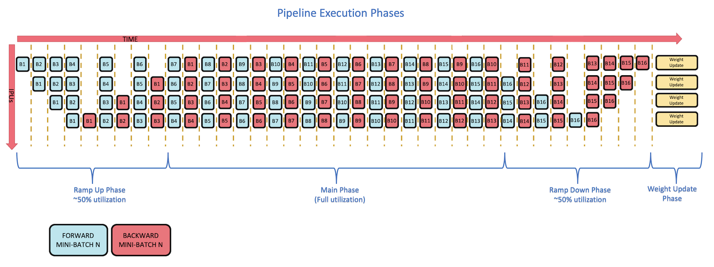


Tutorial Walkthrough
====================

This tutorial starts with a simple multi-stage model that trains on the MNIST dataset.  

Note:  

* Your 'real-world' models are probably more complicated, but the techniques learned in this tutorial can still be applied.  
* The results you see locally will depend on which IPU hardware you run on and which SDK you are using.  
* Similarly, when looking at profiling reports you have generated yourself, they may not look exactly the same as the reports presented in this tutorial.  
* The `scripts/profile.sh` helper script is used to capture profiling reports; this will  
  a) override the application parameters to run just a single step without repeat and with constrained batch accumulation,  
  b) enable autoReport to capture all reports,  
  c) enable synthetic data to remove host IO from the execution trace.  


Tutorial Step 1: The Existing Single IPU Application
----------------------------------------------------

See [`step1_single_ipu.py`](step1_single_ipu.py)  

This is our starting point. Take a look at the code and familiarise yourself with it. 

The model is running on a single IPU without pipelining.

Run it with `$ python3 step1_single_ipu.py`  

You should see it train with output similar to this below.

```
$ python3 step1_single_ipu.py
<CUT>
Steps 586 x examples per step 5120 (== 3000320 training examples, 50.00533333333333 epochs of 60000 examples)
<CUT>
Step 0, Epoch 0.0, Mean loss: 2.157
Step 10, Epoch 0.9, Mean loss: 0.351
<CUT>
Step 585, Epoch 49.9, Mean loss: 0.001
Elapsed <CUT>
```

If you see output something like this below then it means that you forgot to install the Graphcore TensorFlow 1 wheel. See [the Requirements section](#requirements).

```
Traceback (most recent call last):
  File "step1_single_ipu.py", line 6, in <module>
    import tensorflow.compat.v1 as tf
ModuleNotFoundError: No module named 'tensorflow'
```

This is the model outline:

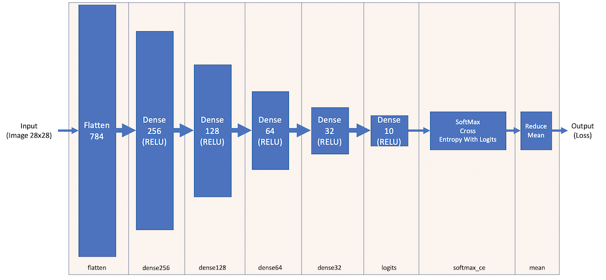

The loss is optimized using `GradientDescentOptimizer` and `GradientAccumulationOptimizerV2`:

```python
optimizer = tf.train.GradientDescentOptimizer(learning_rate=learning_rate)
if args.batches_to_accumulate > 1:
    optimizer = ipu.optimizers.GradientAccumulationOptimizerV2(
            optimizer, num_mini_batches=args.batches_to_accumulate)
train_op = optimizer.minimize(loss=loss)
```

The `GradientAccumulationOptimizerV2` is a wrapper for an optimizer where instead of performing the weight update for every batch, gradients across multiple batches are accumulated. After multiple batches have been processed, their accumulated gradients are used to compute the weight update. The effective batch size is the product of the model batch size and the gradient accumulation count. The `GradientAccumulationOptimizerV2` optimizer can be used to wrap any other TensorFlow optimizer. In this case it is wrapping a `GradientDescentOptimizer`. 

See the TensorFlow 1 API documentation for details: [GradientAccumulationOptimizerV2](<https://docs.graphcore.ai/projects/tensorflow-user-guide/en/latest/api.html#tensorflow.python.ipu.optimizers.GradientAccumulationOptimizerV2>)


Generate a profile report into directory `./profile_step1_single_ipu` with:

`$ scripts/profile.sh step1_single_ipu.py`

Use PopVision Graph Analyser to view the execution trace.
Remember that the `profile.sh` script limits the execution to a single batch.

If this is your first time using the PopVision Graph Analyser, then see the user guide: [PopVision User Guide](<https://docs.graphcore.ai/projects/graphcore-popvision-user-guide/en/latest/index.html#popvision-user-guide>)

You should see something like this (zoomed in to show a single mini-batch):

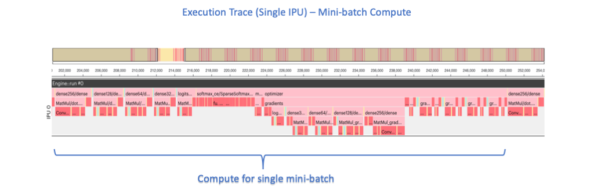

The key points to note are:

* IPU0 runs all layers from 'flatten' to 'softmax_ce' and the optimizer.  
* Because `GradientAccumulationOptimizerV2` is being used, the gradient descent is deferred until `args.batches_to_accumulate` mini-batches have been processed.
* The application uses `with tf.variable_scope(...)` to declare a context manager for each layer; variables and ops inherit the scope name, which provides useful context in the Graph Analyser.

Scroll to the far right in Graph Analyser to see the gradient descent step:

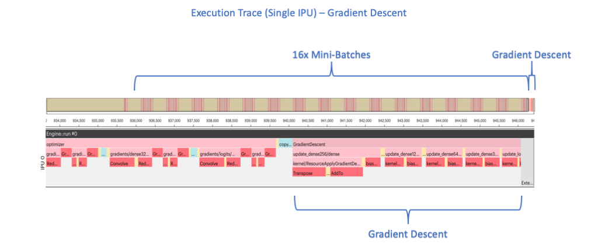


Tutorial Step 2: Running The Model On Multiple IPUs Using Sharding
------------------------------------------------------------------

Let's look at how we can shard a model to run it on multiple IPUs **without** pipelining.  

This model outline shows how the operations will be allocated to shards:

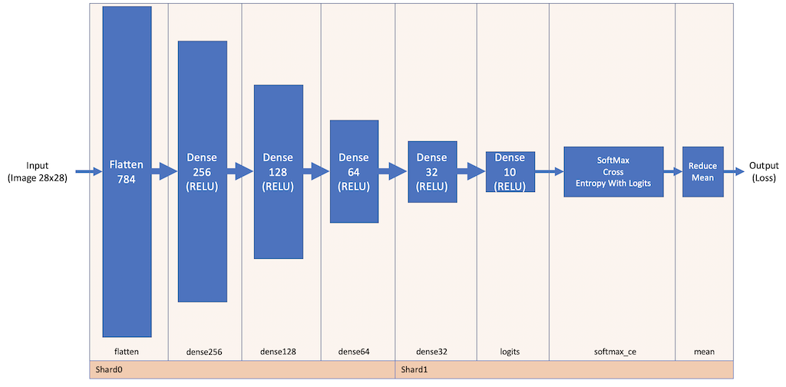

### Tutorial Step 2: Code Changes

First, create a copy of the initial program `step1_single_ipu.py`, naming it `step2_sharding.py`, using the following shell command:  

```
$ cp step1_single_ipu.py step2_sharding.py
```

Now modify `step2_sharding.py`, following instructions a) to d) below:

a) Add a sharding scope `ipu.scopes.ipu_shard(0):`; this will be the context for the set of layers that will end up running on IPU0.
b) Add a sharding scope `ipu.scopes.ipu_shard(1):`; this will be the context for the set of layers that will end up running on IPU1.
c) Split the model across the two scopes, so that IPU0 runs layers 'flatten' to 'dense64' and IPU1 runs layers 'dense32' to 'softmax_ce' plus the optimizer.  

After this change is applied, the model definition function should look like this:  

```python
def model(learning_rate, images, labels):
    # Receiving images,labels (x args.batch_size) via infeed.    
    # The scoping here helps clarify the execution trace when using --profile.

    with ipu.scopes.ipu_shard(0):
        with tf.variable_scope("flatten"):
            activations = layers.Flatten()(images)
        with tf.variable_scope("dense256"):
            activations = layers.Dense(256, activation=tf.nn.relu)(activations)
        with tf.variable_scope("dense128"):
            activations = layers.Dense(128, activation=tf.nn.relu)(activations)
        with tf.variable_scope("dense64"):
            activations = layers.Dense(64, activation=tf.nn.relu)(activations)
    with ipu.scopes.ipu_shard(1):
        with tf.variable_scope("dense32"):
            activations = layers.Dense(32, activation=tf.nn.relu)(activations)
        with tf.variable_scope("logits"):
            logits = layers.Dense(10)(activations)
        with tf.variable_scope("softmax_ce"):
            cross_entropy = tf.nn.sparse_softmax_cross_entropy_with_logits(
                labels=labels, logits=logits)
        with tf.variable_scope("mean"):
            loss = tf.reduce_mean(cross_entropy)
        with tf.variable_scope("optimizer"):
            optimizer = tf.train.GradientDescentOptimizer(learning_rate=learning_rate)
            if args.batches_to_accumulate > 1:
                optimizer = ipu.optimizers.GradientAccumulationOptimizerV2(
                        optimizer,
                        num_mini_batches=args.batches_to_accumulate)
            train_op = optimizer.minimize(loss=loss)
        # A control dependency is used here to ensure that
        # the train_op is not removed.
        with tf.control_dependencies([train_op]):
            return learning_rate, outfeed_queue.enqueue(loss)
```

d) Increase the IPU count from 1 to 2.

After this change is applied, the IPU selection should look like this:

```python
ipu_configuration.auto_select_ipus = 2
```

Now, run the modified application with the following shell command:  

`$ python3 step2_sharding.py`  

You should see it train with output something like this below.

```
$ python3 step2_sharding.py
<CUT>
Steps 586 x examples per step 5120 (== 3000320 training examples, 50.00533333333333 epochs of 60000 examples)
<CUT>
Step 0, Epoch 0.0, Mean loss: 2.184
Step 10, Epoch 0.9, Mean loss: 0.362
<CUT>
Step 585, Epoch 49.9, Mean loss: 0.001
Elapsed <CUT>
```

Generate a profile report into directory `./profile_step2_sharding` with:  

`$ scripts/profile.sh step2_sharding.py`  

Use PopVision Graph Analyser to view the execution trace.  

You should see something like this (zoomed in to show a single mini-batch):  

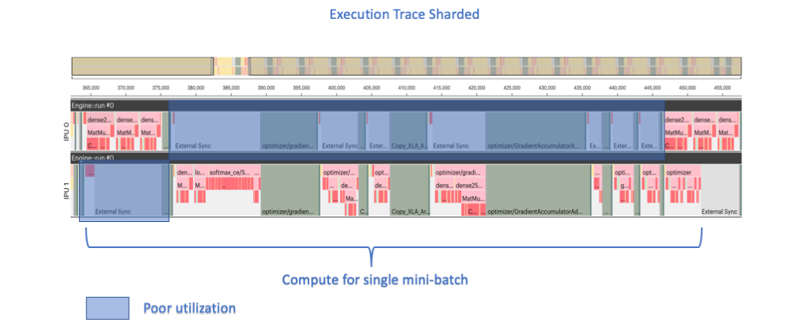

The key points to note are:

* IPU0 runs layers 'flatten' to 'dense64'.
* IPU1 runs layers 'dense32' to 'softmax_ce' and the optimizer.
* It is not efficient because execution is serialised (there is poor utilisation).
* Because `GradientAccumulationOptimizerV2` is being used, the gradient descent is deferred until `args.batches_to_accumulate` mini-batches have been processed.
* In this specific captured example, the gradients are calculated entirely on IPU1.  

Also, note that for a small model such as this one, that fits on a single IPU, sharding does not bring any performance advantages. In fact, because data exchange between IPUs is slower than data exchange within an IPU, the performance will be worse than that without sharding.

The completed code for this step can be found here: [`answers/step2_sharding.py`](answers/step2_sharding.py)  


Tutorial Step 3: Using pipelining for better IPU utilization
------------------------------------------------------------

Let's look at how we can modify the application to run the model on multiple IPUs **with** pipelining.  

This model outline shows how the operations will be defined as layers and allocated to stages:

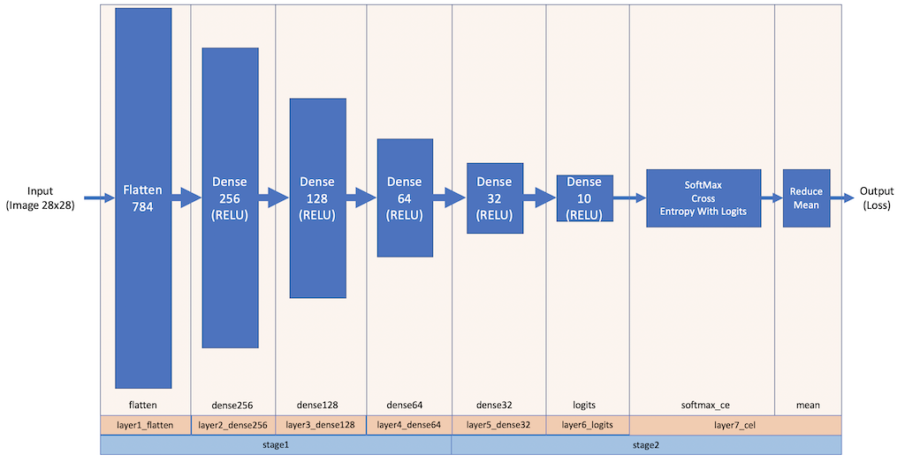


First, let's take a look at the TensorFlow 1 pipelining API.

### The TensorFlow 1 Pipelining API

Here is an example of how the pipelining API can be used. The parameters used here are for illustrative purposes only.  

```python
from tensorflow.python.ipu.ops import pipelining_ops
...
pipeline_op = pipelining_ops.pipeline(
    computational_stages=[stage1, stage2, stage3, stage4],
    gradient_accumulation_count=8,
    repeat_count=2,
    inputs=[learning_rate],
    infeed_queue=infeed_queue,
    outfeed_queue=outfeed_queue,
    optimizer_function=optimizer_function,
    pipeline_schedule=PipelineSchedule.Grouped,
    outfeed_loss=True,
    name="Pipeline")
...
```

For convenience, the key parameters are described here inline:  

* `computation_stages`: a list of Python functions, where each function represents a computational pipeline stage. Each function takes the outputs of the previous pipeline stage as its inputs.
* `gradient_accumulation_count`: the number of times each pipeline stage will be executed.
* `repeat_count`: the number of times the pipeline will be executed for each session `run()` call.
* `inputs`: arguments passed to the first pipeline stage.
* `infeed_queue`: optional IPUInfeedQueue, if passed, it is dequeued and passed as an input in the first pipeline stage.
* `outfeed_queue`: IPUOutfeedQueue, required if the last computational stage has any outputs. The outputs of these are enqueued to this queue and they can be accessed on the host.
* `optimizer_function`: optional Python function which takes the output of the last computational stage as parameters and returns an instance of `pipelining_ops.OptimizerFunctionOutput` in order to generate the back-propagation and weight-update parts of the model suitable for training.
* `pipeline_schedule`: which scheduling algorithm to use for pipeline lowering. Defaults to `PipelineSchedule.Grouped` (See [the Scheduling section](#scheduling).).
* `outfeed_loss`: if True, the loss given by the optimizer_function will be enqueued on the outfeed, instead of the outputs from the last computational stage.

See the TensorFlow 1 API documentation for details: [TensorFlow 1 Pipeline Operator](<https://docs.graphcore.ai/projects/tensorflow1-user-guide/en/latest/api.html#tensorflow.python.ipu.pipelining_ops.pipeline>)  


### Scheduling

The precise sequencing of forward and backward passes for the mini-batches can be adjusted using the scheduling parameter `pipeline_schedule`.  
The differences are most significant when training and you may need to experiment to find which method works best for your model.  

Refer to the technical note on TensorFlow Model Parallelism for full details: [TensorFlow Model Parrallelism - Pipeline Scheduling](<https://docs.graphcore.ai/projects/tf-model-parallelism/en/latest/pipelining.html#pipeline-scheduling>)

#### Sequential Scheduling

When sequential scheduling is used, the pipelined stages are serialised so only one stage is being executed at any given point in time.  
This removes the overlapped execution and so reduces IPU utilisation in the same way that sharded parallelism does. 
It can be used during debugging of the model.

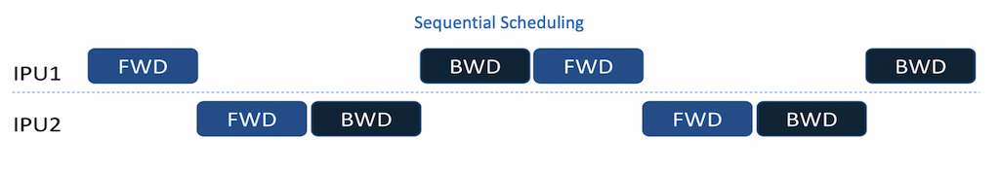

#### Interleaved Scheduling

When interleaved scheduling is used, the pipelined stages run forward and backward passes in an alternating pattern. IPU utilisation may not be as optimal since a forward pass usually requires fewer cycles than a backwards pass.

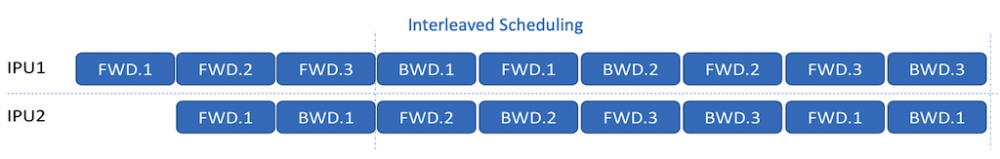

#### Grouped Scheduling

When grouped scheduling is used, then at any given point in time, the pipelined stages are either all running their forward pass or all running their backward pass. IPU utilisation is more likely to be balanced compared to interleaved scheduling since all IPUs are running either forward pass compute or backward pass compute. Memory requirements may go up when compared to interleaved scheduling to cover an increase in 'in-flight' mini-batches.  

This is the default scheduling mode.  

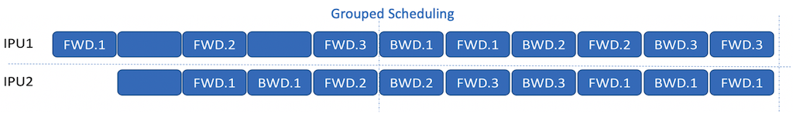

To better understand the increase in memory requirements, see the Grouped Scheduling diagram here:

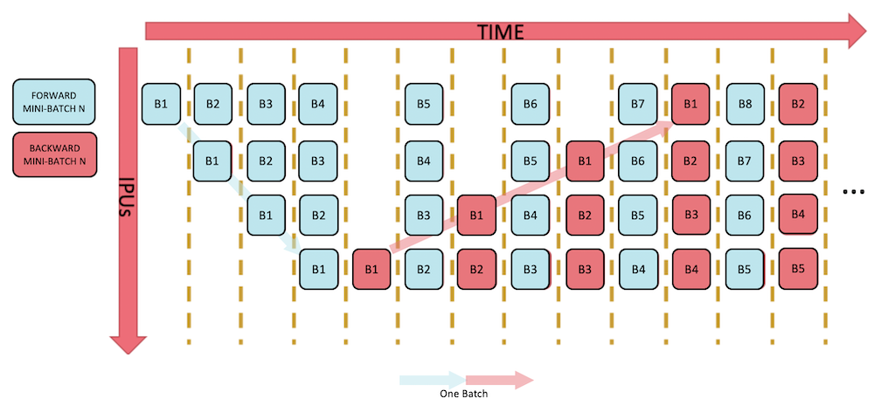

Follow the first mini-batch from time-step 1 through the pipeline. Observe that it completes its backwards pass at time-step 11.

Compare this with the Interleaved Scheduling diagram here:

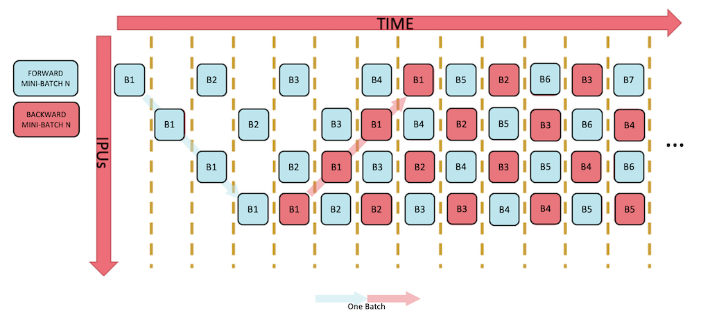

Follow the first mini-batch from time step 1 through the pipeline. Observe that it completes its backwards pass at time-step 8.

This demonstrates the inherent increase of inflight mini-batches and therefore memory when using Grouped Scheduling.

### Tutorial Step 3: Code Changes

Now, let's apply this to our application.  
First, create a copy of the program `step2_sharding.py`, naming it `step3_pipelining.py`, using the following shell command:  

```
$ cp step2_sharding.py step3_pipelining.py
```

Now modify it, following instructions a) to j) below:

a) Break down the single model definition `model` into a series of layer definitions; the first layer is `layer1_flatten`.

Remember, the pipelining API takes a series of Python functions as `computational_stages`; to support this, first we will make each layer its own Python function.  
The first layer must take the explicit 'learning_rate' (learning rate) argument and implicit (feed) arguments 'images' and 'labels' as arguments.  
It should return the same 'learning_rate', layer output ('activations'), and 'labels'. These will be fed to the next layer as input arguments.  

```python
def layer1_flatten(learning_rate, images, labels):
    with tf.variable_scope("flatten"):
        activations = layers.Flatten()(images)
        return learning_rate, activations, labels
```

b) Add the next layer definition, `layer_dense256`

Each subsequent layer must take the outputs of the previous layer as arguments.  
This dense layer should return the 'learning_rate', layer output ('activations'), and 'labels'.  

```python
def layer2_dense256(learning_rate, activations, labels):
    with tf.variable_scope("flatten"):
        activations = layers.Dense(256, activation=tf.nn.relu)(activations)
        return learning_rate, activations, labels
```

c) Continue similarly for layers 3,4,5 (`layer3_dense128`, `layer4_dense64`, `layer5_dense32`).

d) Add layer 6 `layer6_logits`

Here we take activations and return logits.  

```python
def layer6_logits(learning_rate, activations, labels):
    with tf.variable_scope("logits"):
        logits = layers.Dense(10)(activations)
        return learning_rate, logits, labels
```

e) For the cross entropy loss and mean, let's combine these into a single cross-entropy loss layer, `layer7_cel`.

This layer must take the outputs from `layer6_logits` as arguments.  
It should return just 'learning_rate' and final 'loss'.  

```python
def layer7_cel(learning_rate, logits, labels):
    with tf.variable_scope("softmax_ce"):
        cross_entropy = tf.nn.sparse_softmax_cross_entropy_with_logits(
            labels=labels, logits=logits)
    with tf.variable_scope("mean"):
        loss = tf.reduce_mean(cross_entropy)
        return learning_rate, loss
```

f) Add an optimizer function, `optimizer_function`.

This function must take the outputs from the last layer, `layer7_cel`, as arguments; these are 'learning_rate' and 'loss'.   
Return a `tf.train.GradientDescentOptimizer` with argument learning_rate=learning_rate.  
Return the optimizer and the loss wrapped with `ipu.pipelining_ops.OptimizerFunctionOutput`.  

```python
def optimizer_function(learning_rate, loss):
    # Optimizer function used by the pipeline to automatically set up
    # the gradient accumulation and weight update steps
    optimizer = tf.train.GradientDescentOptimizer(learning_rate=learning_rate)
    return ipu.pipelining_ops.OptimizerFunctionOutput(optimizer, loss)
```

g) Remove the definition for `loop_repeat_model`; add a definition for `pipelined_model`

When the pipeline API is used, we specify repeat count and gradient accumulation count so the explicit `loop_repeat_model` wrapper is redundant.  
Remove the `loop_repeat_model` function and add a `pipelined_model` in its place.  
We will implement `pipelined_model` to define two stages and return these via the pipeline API.  
The following shows what this should look like with inset comments:  

```python
def pipelined_model(learning_rate):
    # Defines a pipelined model which is split accross two stages
```

Within `pipelined_model`, add a definition for 'stage1'.  This must:

- take the initial arguments ('learning_rate', 'images' and 'labels') as input.  
- issue the previously defined layers `layer1_flatten` through to `layer4_dense64` in sequence.  
- pass the returns of each layer into the next layer.  
- return the results of the final layer.  

```python
    def stage1(learning_rate, images, labels):
        r = layer1_flatten(learning_rate, images, labels)
        r = layer2_dense256(*r)
        r = layer3_dense128(*r)
        r = layer4_dense64(*r)
        return r
```

Within `pipelined_model`, add a definition for the next stage, 'stage2'.  This must:

- take the outputs returned from 'stage1' as input.  
- issue the previously defined layers `layer5_dense32` through to `layer7_cel` in sequence.  
- pass the returns of each layer into the next layer.  
- return the results of the final layer.  

```python
    def stage2(*r):
        r = layer5_dense32(*r)
        r = layer6_logits(*r)
        r = layer7_cel(*r)
        return r
```

Within `pipelined_model`, add the pipeline operation itself using the `ipu.pipelining_ops.pipeline` API.  
Use these arguments:  

 `computational_stages` - specify the previously defined 'stage1' and 'stage2'.  
 `gradient_accumulation_count` - specify the existing args.batches_to_accumulate.  
 `repeat_count` - specify the existing args.repeat_count.  
 `inputs` - specify input arguments that are additional to those provided by the infeed queue; this is 'learning_rate'.  
 `infeed_queue` - specify the existing infeed_queue.  
 `outfeed_queue` - specify the existing outfeed queue.  
 `optimizer_function` - specify the previously defined optimizer function.  
 `pipeline_schedule` - specify 'ipu.pipelining_ops.PipelineSchedule.Grouped'.

```python
    with tf.variable_scope("FCModel", use_resource=True):
        pipeline_op = ipu.pipelining_ops.pipeline(
            computational_stages = [stage1, stage2],
            gradient_accumulation_count = args.batches_to_accumulate,
            repeat_count = args.repeat_count,
            inputs = [learning_rate],
            infeed_queue = infeed_queue,
            outfeed_queue = outfeed_queue,
            optimizer_function = optimizer_function,
            pipeline_schedule = ipu.pipelining_ops.PipelineSchedule.Grouped,
            name = "Pipeline")
    return pipeline_op
```

Notes:  

* The computational stages, which are executed in sequence, define the points at which the model is split across IPUs. All model variables which are used in multiple stages must be passed between IPUs. Consider this detail when deciding where to put the split points for more complex pipelined models.
* Infeeds and outfeeds are introduced here: [Targeting the IPU from TensorFlow 1](<https://docs.graphcore.ai/projects/tensorflow1-user-guide/en/latest/perf_training.html#training-loops-data-sets-and-feed-queues>)
* This tutorial demonstrates how an input, `learning_rate`, can be passed into the pipeline and propagated through all layers/stages to where it is needed, in this case, the optimizer. In reality, for this simple application, `learning rate` is effectively static and could be removed and hardcoded.


h) Update step calculation

The pipeline API encapsulates the repeat count and gradient accumulation count. With gradient accumulation count `GAC` and repeat count `RPT`, each session.run() will process `GAC`*`RPT` batches.  

Where `examples_per_step` was previously calculated as:  

```python
    # With batch size BS and repeat count RPT,
    # at every step n = (BS * RPT) examples are used.
    # Ensure we process a whole multiple of the batch accumulation count.
    remainder = args.repeat_count % args.batches_to_accumulate
    if remainder > 0:
        args.repeat_count += args.batches_to_accumulate - remainder
        print(f'Rounding up repeat count to whole multiple of '
              f'batches-to-accumulate (== {args.repeat_count})')
    examples_per_step = args.batch_size * args.repeat_count
```

Replace it with:  

```python
    # With batch size BS, gradient accumulation count GAC and repeat count RPT,
    # at every step n = (BS * GAC * RPT) examples are used.
    examples_per_step = args.batch_size * args.batches_to_accumulate * args.repeat_count
```

Change the default repeat count to 10 (from 160).  
The pipelined version will still process 160 batches each step (`GAC` 16 * `RPT` 10 == 160).  

```python
    parser.add_argument("--repeat-count", type=int, default=10,
                        help="The number of times the pipeline will be executed for each step.")
```

i) Compile the new `pipelined_model` instead of `loop_repeat_model`

```python
    with ipu.scopes.ipu_scope("/device:IPU:0"):
        compiled_model = ipu.ipu_compiler.compile(pipelined_model, inputs=[learning_rate])
```

j) Modify the IPU config

Add a line to the IPU configuration code to specify `selection_order`. Set it to SNAKE.  

```python
ipu_configuration.selection_order = ipu.utils.SelectionOrder.SNAKE
```

This configures the logical IPU indexing so that logically adjacent IPUs are physically linked. This makes the exchange of data between these IPUs (pipeline stages) more efficient. The default `selection_order` is AUTO which automatically tries to select the best selection order given the model. You can override it, as we do in this tutorial, if you have a specific requirement and want to be sure it is used.

For details, including other options, see the [TensorFlow 1 User Guide - Selection Order](<https://docs.graphcore.ai/projects/tensorflow1-user-guide/en/latest/api.html#tensorflow.python.ipu.config.SelectionOrder>)

Now, run the modified application with the following shell command:  

```
$ python3 step3_pipelining.py
```

You should see it train with output something like this below.

```
$ python3 step3_pipelining.py
<CUT>
Steps 586 x examples per step 5120 (== 3000320 training examples, 50.00533333333333 epochs of 60000 examples)
<CUT>
Step 0, Epoch 0.0, Mean loss: 2.174
Step 10, Epoch 0.9, Mean loss: 0.425
<CUT>
Step 585, Epoch 49.9, Mean loss: 0.001
Elapsed <CUT>
```

Generate a profile report into directory `./profile_step3_pipelining` with:  

`$ scripts/profile.sh step3_pipelining.py`  

Use PopVision Graph Analyser to view the execution trace.  

You should see something like this:  

The initial ramp-up phase where the first batches are pushed through the pipeline.  
In this phase we can see it takes a while before both IPUs are working simultaneously.  

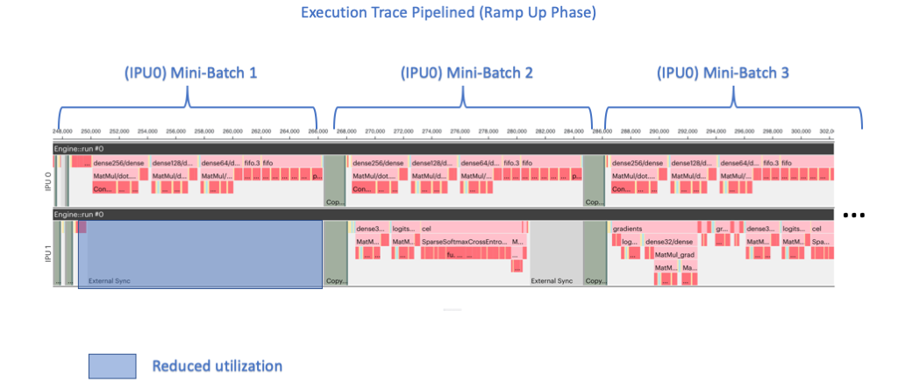

The main execution phase where both IPUs are working simultaneously on different batches.  

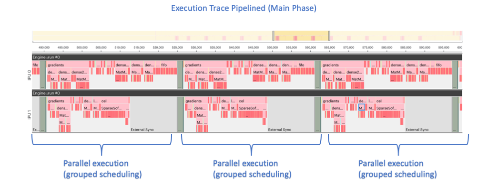

The final ramp-down phase where the gradient descent is applied and weights updated.  

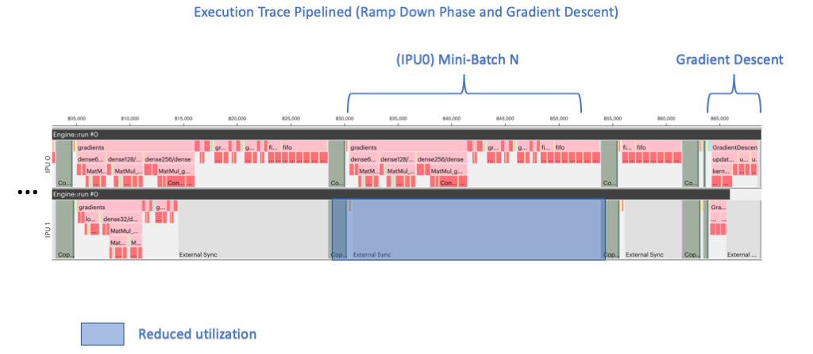


The key points to note are:

* IPU0 runs layers 'flatten' through to 'dense64'.
* IPU1 runs layers 'dense32' through to 'softmax_ce'.
* The backward passes and weight updates for each layer are performed on the same IPU as the forward passes.
* It is better than sharding because execution is parallelised (utilization is improved).
* Because `ipu.pipelining_ops.pipeline` is being used, the gradient descent is deferred to the end of the execution (until all mini-batches have been processed).

Also, note:  
* Although pipelining is better than sharding, the overheads from data exchange between IPUs still have an impact.  
* The number of IPUs in a multi-IPU device must be a power of 2. For example, if you try to select 3 IPUs to run 3 stages then you will see an error: `Unsupported number of IPUs requested - could not find an IPU device with 3 IPUs`

During the development and tuning of your pipelined model, the general aim is to balance the execution cycles across all the IPUs in the main phase, so that utilisation is maximised.  
With the simple example in this tutorial, the default split is already reasonably balanced, but try the extension exercises to see how the balance/behviour can be modified.  
These tutorial examples keep the repeat count quite low. For production code you should increase the repeat count in order to maximise the time spent running on the IPU and minimise interactions with the host.  

### Tutorial Step 3 : Extension

#### Pipeline Schedule

Try changing `pipeline_schedule` to `PipelineSchedule.Interleaved` and/or `PipelineSchedule.Sequential`.  
Recapture the profile reports and see how the execution trace changes in each case compared to the original version.  

#### Repeat count

Run with different values of `--repeat-count` and observe how that changes performance.

#### Stages

Try modifying the layers assigned to each stage.  
Try splitting the layers up over more stages.  
Recapture the profile reports and see how the execution trace changes in each case compared to the original version.  

The code changes for this step can be found here: [`answers/step3_pipelining.py`](answers/step3_pipelining.py)  


Tutorial Step 4: Run-time Configurable Stages
---------------------------------------------

During the development and tuning of more complex models there are often multiple hyperparameters that can be adjusted. Even in this tutorial's simple pipelining application, we can adjust the batch size, the gradient accumulation count and the stages. It is easier to experiment with these options if they can be configured from the command line.

Batch size and gradient accumulation count are already configurable from the command line (`--batch-size`, `--batches-to-accumulate`). But the 'stages' are currently hardcoded by the series of 'stageN' functions defined locally in `pipelined_model`.  

In this next step we will add code to support run-time configurable stages. There are many ways this could be implemented, but we only demonstrate one method here.

### Tutorial Step 4: Code Changes

First, take the program `step3_pipelining.py` and rename it to `step4_configurable_stages.py`.  

```
$ cp step3_pipelining.py step4_configurable_stages.py
```

Now modify it, following instructions a) to f) below:

a) Add a new argument `--splits` with which the user can specify the points to 'split' the model.  

This should take multiple string arguments where each argument defines the split point. This is the layer that will be assigned to the *next* stage. The implication is that for N `--split` arguments the model will run on N+1 stages and IPUs. Let's assume that will create a model_layers dictionary from which we can generate a list of layer ids.  

```python
    parser.add_argument("--splits", nargs="+", help="Specify splits. " +
                        "Each split specifies the layer that will be assigned to the *next* stage. " +
                        "The layers are: " + 
                        ", ".join([layer["id"] for layer in model_layers])+". ",
                        default=["dense32"])
```

By setting `nargs="+"`, we can accept a variable number of arguments. For more details about the `argparse` library, see the [Python argparse Documentation](<https://docs.python.org/3/library/argparse.html>)

b) Add a function `discover_layers` that will return a sorted list of layers. 

This can use `globals()` to find all functions that match a specific syntax.  

- Find all functions that match `layer<idx>_<id>`.  For example, this should find `layer1_flatten` and return an entry with idx==1 and id=="flatten".  
- Make each returned layer in the list a dictionary with keys 'func', 'id' and 'idx'.  
- Layers should be sorted by 'idx' but do not need to be strictly sequential; this is so 'gaps' can be left to support insertion of layers when writing/developing your model.  

```python
def discover_layers():
    # This parses global functions with form "layer<n>_<id>"
    # e.g. "layer3_BlockA"
    # The layers will be sorted by <n>
    # A layer list of dictionaries is returned with:
    #   "func" : Function reference
    #   "id"   : String name of layer (==<id>)
    layers = []
    global_symbols = globals()
    prefix = "layer"
    layer_funcs = [key for key in global_symbols if key.startswith(prefix)]
    for layer_func in layer_funcs:
        try:
            idx_id = layer_func[len(prefix):]
            idx, id = idx_id.split("_")
            layers.append({"func": global_symbols[layer_func], 
                           "id": id, "idx": int(idx)})
        except:
            pass

    def use_idx(e):
        return e["idx"]

    layers.sort(key=use_idx)
    return layers
```

c) Add a function that will take the layer list and 'splits' argument and return a list of stages.  

Each stage should be a list of those layers in that stage.  

```python
def move_layers_to_stages(layers, splits):
    # Sequence layers into distinct groups (stages)
    # according to splits.
    def next_split_layer():
        # Returns idx of layer matching id.
        if stage >= len(splits):
            return None
        split = splits[stage]
        try:
            return next(layer for layer in layers if (layer["id"] == split))
        except:
            print("Failed to match split layer with id \"{}\"".format(split))
            return None

    stages = [[]]
    stage = 0
    idx = 0
    next_split = next_split_layer()
    while len(layers):
        ly = layers.pop(0)
        if ly == next_split:
            stage += 1
            stages.append([])
            next_split = next_split_layer()
        stages[stage].append(ly)
    return stages
```

d) Remove the hard coded stage definitions from `pipelined_model` and build a list of dynamically generated stages. 

Add a local helper to `pipelined_model` that will build a stage from the list of associated layers.  
The arguments can be sequenced through the layers.  

```python
    # Helper that defines a single stage consisting of one or more layers
    def make_pipeline_stage(idx, stage):        
        def _stage(*args):
            for layer in stage:
                with tf.variable_scope("stage"+str(idx)+"_"+layer["id"], use_resource=True):
                    print("Issuing stage {} layer {}".format(idx, layer["id"]))
                    args = layer["func"](*args)
            return args
        return _stage
```

Build a list of computational_stages that can be passed to the pipelining API.  

```python
    # Make each stage (function) and add it to the computational stages
    computational_stages = []
    for idx, stage in enumerate(stages):
        f = make_pipeline_stage(idx, stage)
        computational_stages.append(f)    
```

Update the pipelining APIs `computational_stages` to use the dynamically generated list.  

```python
        computational_stages = computational_stages,
```

e) Update the programs main block to use the new features.

Add a line to call `discover_layers`. Add this before `parse_args` so that the available layers can be reported for the new `--splits` argument.  
Add a line to call `move_layers_to_stages`; return as `stages`.  
The following example also includes some additional logging and error reporting.  

```python
    model_layers = discover_layers()

    # Show final list of layers
    print("Layers:")
    layer_list = [layer["id"] for layer in model_layers]
    print(" "+(", ".join(layer_list)))

    args = parse_args()

    # Sequence layers into stage-groups
    stages = move_layers_to_stages(model_layers, args.splits)
    if (len(stages) != len(args.splits)+1):
        print("Unexpected stage count - check splits are valid")
        exit(-1)

    # Show final list of staged layers
    print("Stages:")
    for idx, stage in enumerate(stages):
        layer_list = [layer["id"] for layer in stage]
        print(" "+str(idx)+". "+("-".join(layer_list)))
        if len(layer_list) == 0:
            print("Unexpected empty stage - check splits are valid")
            exit(-1)
```

f) Update the IPU count to match the number of stages.

Use the 'splits' argument to set IPU count.  

```python
    cfg.auto_select_ipus = len(args.splits)+1
```

Now, run the modified application with the following shell command:  

`$ python3 step4_configurable_stages.py`  

You should see it train with output something like this below.

```
$ python3 step4_configurable_stages.py
<CUT>
Layers:
 flatten, dense256, dense128, dense64, dense32, logits, cel
Stages:
 0. flatten-dense256-dense128-dense64
 1. dense32-logits-cel
Steps 586 x examples per step 5120 (== 3000320 training examples, 50.00533333333333 epochs of 60000 examples)
Issuing stage 0 layer flatten
Issuing stage 0 layer dense256
Issuing stage 0 layer dense128
Issuing stage 0 layer dense64
Issuing stage 1 layer dense32
Issuing stage 1 layer logits
Issuing stage 1 layer cel
<CUT>
Step 0, Epoch 0.0, Mean loss: 2.165
Step 10, Epoch 0.9, Mean loss: 0.379
<CUT>
Step 585, Epoch 49.9, Mean loss: 0.001
Elapsed <CUT>
```

Try specifying a different split point. For example, using the following shell command:

`python3 step4_configurable_stages.py --splits dense128`

Try specifying multiple splits. For example. using the following shell command:

`python3 step4_configurable_stages.py --splits dense128 dense64 dense32`

The code changes for this step can be found here: [`answers/step4_configurable_stages.py`](answers/step4_configurable_stages.py)  

Further Considerations
======================

This section calls out some additional features and parameters that can affect performance when pipelining.  

Always refer to the technical note on TensorFlow pipelining for the most up-to-date and detailed information: [TensorFlow Model Parallelism - Pipelining](<https://docs.graphcore.ai/projects/tf-model-parallelism/en/latest/pipelining.html#pipelining>)


Recomputation
-------------

When pipelining, the forward activations of each operation will be saved so that they are available to compute the gradients in the backwards pass. This may require significant memory. If IPU memory is limited, then _recomputation_ can be used to reduce the memory used to store activations. With recomputation enabled, activations are only saved for a selected subset of the forward operations. The activations which were not saved will be recomputed as part of the backwards pass. This saves IPU memory at the expense of requiring more compute. Pipelining can be used with a single IPU in order to use recomputation, where using recomputation allows a model and mini-batch size to fit that would otherwise be out-of-memory on the IPU.

Refer to the technical note on TensorFlow Model Parallelism for full details: [TensorFlow Model Parallelism - Pipelining Recomputation](<https://docs.graphcore.ai/projects/tf-model-parallelism/en/latest/pipelining.html#recomputation>)

Variable Offloading 
-------------------

If IPU memory is limited, then variable offloading can be used. This will store some variables and activations in Streaming Memory. This saves IPU memory at the expense of time to swap the data on and off the IPU.

Refer to the technical note on TensorFlow Model Parallelism for full details: [TensorFlow Model Parallelism - Pipelining Variable Offloading](<https://docs.graphcore.ai/projects/tf-model-parallelism/en/latest/pipelining.html#variable-offloading>)


Gradient Accumulation Buffer Data Type
--------------------------------------

Gradients will be accumulated in a buffer when pipelining. The datatype of this buffer can be controlled using the API's `gradient_accumulation_dtype` argument:  

  - `None`: Use an accumulator buffer of the same TensorFlow `DType` as each variable.  
  - A TensorFlow `DType`: Specify the type to use for all accumulation buffers (for example, `tf.float16` or `tf.float32`).  
  - A Python `callable`: User provided callback to support a different `DType` for each variable.  

The default is `None` (use an accumulator buffer of the same `DType` as each variable).  You may want to override this if you are training in float16 and you want to use a float32 accumulator buffer.

See the TensorFlow 1 API documentation for details: [TensorFlow1 Pipelining API](<https://docs.graphcore.ai/projects/tensorflow1-user-guide/en/latest/api.html#tensorflow.python.ipu.pipelining_ops.pipeline>)


Data Parallelism
----------------

It is possible to combine data parallelism with model parallelism by using the standard `CrossReplicaOptimizer`, which is used for training replicated models, in the pipeline optimiser function. In this case:  

`effective batch size` = `replication factor` * `mini-batch size` * `gradient accumulation count`

IPUPipelineEstimator
--------------------

`IPUPipelineEstimator` is a version of `IPUEstimator` that supports pipelining. These APIs handle many of the details of running on IPUs, such as placement of operations and tensors, graph compilation and usage of data feeds. The model function provided to the `IPUEstimator` API must return an instance of `IPUPipelineEstimatorSpec` that contains the information needed for execution including pipelining specific details such as the computational stages and the gradient accumulation count.

The following example is derived from `step3_pipelining.py` and further simplified:  

```python
    ipu_estimator = ipu.ipu_pipeline_estimator.IPUPipelineEstimator(
        config = config,
        model_fn = model_fn,
        params = {
            "learning_rate": args.learning_rate,
            "gradient_accumulation_count": args.batches_to_accumulate
        },
    )


    ipu_estimator.train(input_fn = input_fn, steps = steps)
```

Where `input_fn` provides the dataset and `model_fn` provides the model definition. The `model_fn` might look like this:  

```python
def model_fn(mode, params):

    if not mode == tf.estimator.ModeKeys.TRAIN:
        raise NotImplementedError(mode)

    # Defines a pipelined model which is split accross two stages
    def stage1(images, labels):
        r = layer1_flatten(images, labels)
        r = layer2_dense256(*r)
        r = layer3_dense128(*r)
        r = layer4_dense64(*r)
        return r

    def stage2(*r):
        r = layer5_dense32(*r)
        r = layer6_logits(*r)
        loss = layer7_cel(*r)
        return loss

    def optimizer_function(loss):
        # Optimizer function used by the pipeline to automatically set up
        # the gradient accumulation and weight update steps
        optimizer = tf.train.GradientDescentOptimizer(learning_rate=params["learning_rate"])
        return ipu.pipelining_ops.OptimizerFunctionOutput(optimizer, loss)

    return ipu.ipu_pipeline_estimator.IPUPipelineEstimatorSpec(
        mode,
        computational_stages=[stage1, stage2],
        optimizer_function=optimizer_function,
        gradient_accumulation_count=params["gradient_accumulation_count"])
```

A complete example is provided here : [`answers/ipu_pipeline_estimator.py`](answers/ipu_pipeline_estimator.py)  

Run it with `$ python3 answers/ipu_pipeline_estimator.py`  


See the TensorFlow 1 API documentation for details:  
[TensorFlow IPUPipelineEstimator API](<https://docs.graphcore.ai/projects/tensorflow-user-guide/en/latest/api.html#ipupipelineestimator>)  
[TensorFlow IPUPipelineEstimatorSpec](<https://docs.graphcore.ai/projects/tensorflow-user-guide/en/latest/api.html#tensorflow.python.ipu.ipu_pipeline_estimator.IPUPipelineEstimatorSpec>)  
[TensorFlow IPUPipelineEstimator Example](<https://docs.graphcore.ai/projects/tensorflow-user-guide/en/latest/ipu_pipeline_estimator_example.html>)  

